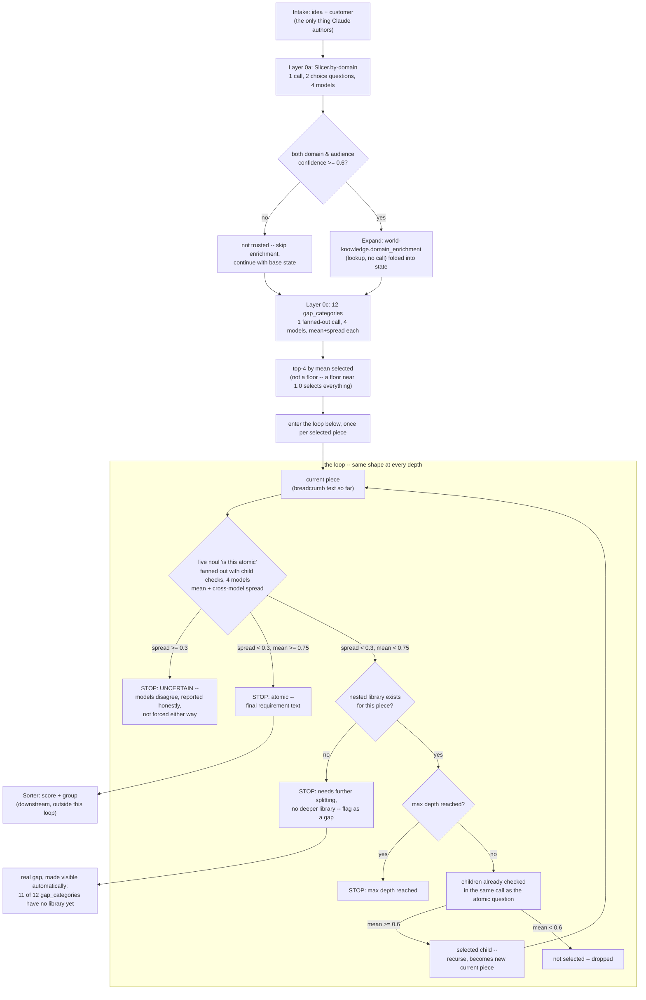

# The toolbox

Five tools, up to five variants each — capped by explicit design decision, not because five
happened to fit. Grinder has only three (`fixed-depth`, `atomic-threshold`, `irreducible-fact`) --
absorbing the old Bouncer tool meant it never needed a fourth or fifth; the other four tools have
five each. Full spec and per-variant tradeoffs live in each tool's own `tools/<name>.yaml`; this
file is just the map. `world-knowledge.yaml` is a sixth file here but not a tool — it's the one
place for everything that isn't a tool: static, reusable reference content the tools enrich a
piece with *after* something's been classified, never itself a live call. It replaces
`customer-lens.yaml`, `domain-library.yaml`, `gap-library.yaml` and
`gap-library-single-point-of-failure.yaml`, all retired — see world-knowledge.yaml's own header
for why.

| Tool | Job | Variants | Status (per each yaml's own `status:` field) |
|---|---|---|---|
| **Slicer** (`slicer.yaml`) | idea or piece → first-pass pieces, each backed by a real classification call against a fixed candidate list | `by-domain`, `by-layer`, `by-risk`, `by-phase`, `binary-halving` | `by-domain` is live (`layered_walk.py`'s Layer 0a) — the only one of the five actually run. Every variant's criteria is defined inline in this file, the single source of truth for what a live call sends — not copied from a separate reference file. |
| **Grinder** (`grinder.yaml`) | re-slice one still-coarse piece, recursively, until it stops producing anything new | `fixed-depth`, `atomic-threshold`, `irreducible-fact` (3, not 5 — see above) | `atomic-threshold` is live (`layered_walk.py`'s `walk_gap`/`layer_n_node`): one fanned-out call per node per model, Confidence-Gated Routing via cross-model spread (atomic / not-atomic / genuinely uncertain — not a flat two-way cut). |
| **Sorter** (`sorter.yaml`) | score each atomic piece (risk if false), group by shared need | `by-domain`, `by-audience`, `by-layer`, `by-phase`, `by-risk-tier` | scoring is live (`funnel.py`'s `bounce_and_weigh`, one battery per piece per model, Composite Scoring). `by-risk-tier` grouping is live too, in `sort_and_rank.py` — the one grouping variant that needs no Slicer metadata beyond the score itself. `by-domain`/`by-audience`/`by-layer`/`by-phase` grouping still need those Slicer variants to have run live to set that metadata, which only `by-domain` has. |
| **Conveyor** (`conveyor.yaml`) | sequence Sorter's groups, estimate how long each takes | `dependency-order`, `risk-first`, `parallel-lanes`, `duration-weighted`, `critical-path` | `risk-first` is live in `sort_and_rank.py`, straight from Sorter's risk tiers. `dependency-order`/`parallel-lanes` are blocked on `depends_on`, still empty everywhere. Last two need a real duration source nothing here can honestly supply — not populated, not to be faked, and not fixable by asking a model to guess a number it has no grounding in. |
| **Spotlight** (`spotlight.yaml`) | rank what most needs answering next (confidence, not schedule) | `risk-plus-disagreement`, `disagreement-only`, `risk-only`, `downstream-impact`, `audience-weighted` | Three of five are live in `sort_and_rank.py` (`risk-plus-disagreement`, `disagreement-only`, `risk-only`) — same inputs, different sort key, no new live call. `downstream-impact` is blocked on `depends_on`. `audience-weighted` is blocked too: it needs a per-piece audience tag, and `by-domain` only classifies the whole idea, not each requirement. |

**Reference, not a tool:** `world-knowledge.yaml` — `gap_categories`/`gap_category_detail` (the
mechanism `layered_walk.py`'s Layer 0c and Layer 1+ actually run), pain points/delights/customer-
journey stages, plus `domain_enrichment` keyed by `by-domain`'s domain ids: for each domain, which
pain points/delights are especially likely and which customer-journey stage carries the most risk.
This is enrichment attached *after* a domain is identified, not used to identify it — the
domain/audience candidate lists themselves live only in `slicer.yaml` (inline, the single source
of truth; a former `domain-library.yaml` duplicated them and was retired for exactly that reason).
**Open question, not yet resolved:** `gap_categories` (Layer 0c) and `by-domain` (Layer 0a) run
independently today — domain classification doesn't narrow which gap categories even get checked,
though it plausibly could (e.g. `compliance-constraint` mattering mainly for a
`compliance-regulated` domain). See `world-knowledge.yaml`'s `open_question`.

## Why the variants were rewritten

The original five Slicer variants (`binary-halving`, `by-layer`, `by-risk`, `by-phase`,
`by-domain`) described *cutting* the problem — producing new piece text — which no classifier,
Jev or local, can do: these models judge text that already exists, they don't generate it. Every
variant's `rule:` has been rewritten to classify against a fixed candidate list instead (`choice`
where the answer is mutually exclusive — domain, audience, biggest risk; `noul` per candidate
where several can apply at once — layer, phase). `binary-halving` needed a real redefinition, not
just a mechanism swap: "cut in half" had no fixed axis to classify against at all, so it's now one
fixed generic two-way choice (people/process vs. capability/technology). Sorter's `by-mean-risk`
and `by-persona` were replaced (not just renamed) to match: `by-mean-risk` depended on
`depends_on`, which has never been populated; `by-persona` assumed a freely-invented persona id,
which no longer exists now that audience is a classified id (criteria defined inline in
`slicer.yaml`'s `by-domain` variant).

Only `by-domain` has actually been run live, inside `layered_walk.py`. The other four rewritten
Slicer variants (`by-layer`, `by-risk`, `by-phase`, `binary-halving`) are still design-only.

## The general looping structure

This is the actual control flow in `layered_walk.py` today (previously `slicer_live.py` +
`grinder_live.py`, both since deleted — superseded, found redundant by an Opus end-to-end review).
Unlike the earlier version of this diagram, the outer driver it describes is no longer hypothetical
-- `layered_walk.py` really does run this once per selected Level 0 piece automatically, not by a
human hand-picking one `--root` per invocation.

**What this makes visible:** the outer-driver gap the earlier version of this diagram described --
a human hand-picking one `--root` per invocation -- is fixed. `layered_walk.py` walks every
selected Level 0 piece automatically (`for cat in selected: walk_gap(...)`). What's still a real,
visible gap: only 1 of 12 `gap_categories` (`single-point-of-failure`) has anything to recurse
into. Top-4 selection means that piece isn't even guaranteed to be selected in a given run anymore
(confirmed: it missed the top-4 in one real run, spread 0.89 on itself) -- which is the honest
tradeoff of replacing a rubber-stamp floor with a real selection.
